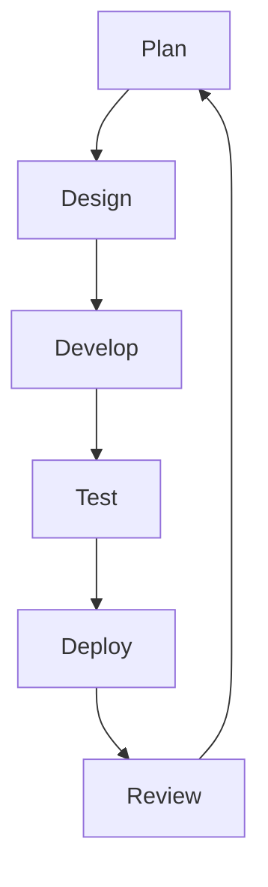
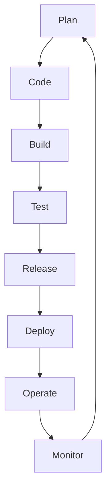

# SDLC Methodologies

## Waterfall approach

Waterfall approach includes 6 phases. 

They are:
- Requirements
- System design
- Implementation
- Testing
- Deployment
- Maintenance

This project management approach differs form others by a comprehensive
documentation and extensive upfront planning. Waterfall methodology minimizes
risk and tends to align well with traditional project management approaches
that depend on detailed records and a clear, predetermined path to follow.

This all is done in the first two phases. The first five steps are done once
for the whole project duration and only the 7th phase, maintenance, is
performed continiously.

Pros:
- Strict budget and time limits

Cons:
- Absence of communication with product consumers
- Absence of flexibility during project realisation
=======

## Agile
The agile methodology is based on an iterative and incremental approach to software development. It focuses on delivering small, functional pieces of software in short cycles called sprints, typically lasting 1-4 weeks. This allows for more flexibility and adaptability as requirements can change throughout the development process.

Agile workflows are typically broken down into the following stages:

### Pros
- Flexibility to adapt to changing requirements
- Faster delivery of working software
- Improved collaboration between teams
- Continuous feedback and improvement

### Cons
- Lack of predictability in terms of scope and timeline
- Requires active involvement from stakeholders
- Can be challenging for large, complex projects

## DevOps Approach

# Specifics 

- Automation of the software development lifecycle: This includes automating testing, builds and other manual tasks that can slow down or introduce human error into the software delivery process.
- Collaboration and communication: Collaboration and communication is also important as it fosters effective team work.
- Continuous improvement and minimization of waste: Devops preaches automating repetitive tasks to watch perfomance metrics for way to improve.
- Hyperfocus on user needs with short feedback loops: Through automation, improved communication and collaboration, and continuous improvement, DevOps teams can take a moment and focus on what real users really want, and how to give it to them.

# Layman Representation

## Pros 

- Faster Delivery of Software: DevOps enables quicker software releases through automation and continuous delivery. This reduces the time between development cycles and accelerates time-to-market.

- Improved Collaboration: DevOps fosters close collaboration between development and operations teams. This breaks down silos and leads to more efficient communication and problem-solving.

- Increased Efficiency through Automation: Automation of tasks like testing, building, and deployment saves time and reduces manual errors. This allows teams to focus on innovation rather than repetitive tasks.

- Enhanced Product Quality: Continuous testing catches bugs early in the development process. This leads to higher-quality releases with fewer issues in production.

- Better Scalability and Flexibility: DevOps supports dynamic scaling with cloud infrastructure and microservices. This enables applications to handle changing demands more efficiently.

## Cons

- Cultural Shift and Resistance: DevOps requires teams to embrace new ways of working, which can be met with resistance. Adjusting to shared responsibilities and collaboration takes time.

- Complex Tooling and Setup: The need for various tools and automation pipelines can make DevOps setups complex. Managing this environment effectively requires significant technical expertise.

