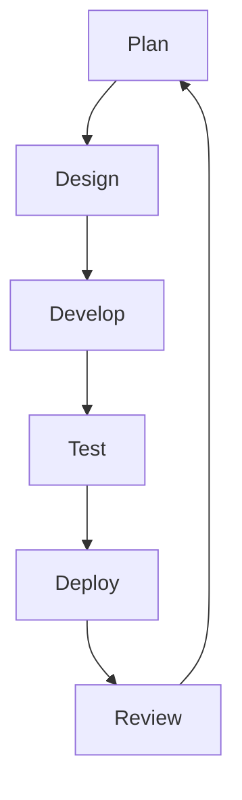

# SDLC Methodologies

## Agile
The agile methodology is based on an iterative and incremental approach to software development. It focuses on delivering small, functional pieces of software in short cycles called sprints, typically lasting 1-4 weeks. This allows for more flexibility and adaptability as requirements can change throughout the development process.

Agile workflows are typically broken down into the following stages:

### Pros
- Flexibility to adapt to changing requirements
- Faster delivery of working software
- Improved collaboration between teams
- Continuous feedback and improvement

### Cons
- Lack of predictability in terms of scope and timeline
- Requires active involvement from stakeholders
- Can be challenging for large, complex projects
