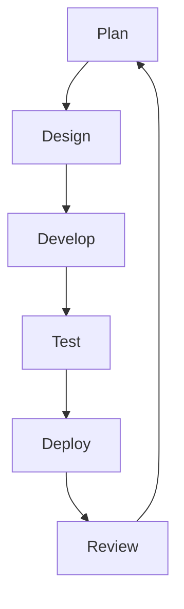
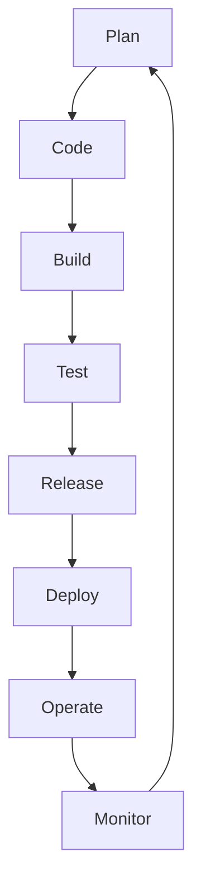

# SDLC Methodologies

## Agile
The agile methodology is based on an iterative and incremental approach to software development. It focuses on delivering small, functional pieces of software in short cycles called sprints, typically lasting 1-4 weeks. This allows for more flexibility and adaptability as requirements can change throughout the development process.

Agile workflows are typically broken down into the following stages:

### Pros
- Flexibility to adapt to changing requirements
- Faster delivery of working software
- Improved collaboration between teams
- Continuous feedback and improvement

### Cons
- Lack of predictability in terms of scope and timeline
- Requires active involvement from stakeholders
- Can be challenging for large, complex projects

## DevOps Approach

# Specifics 

- Automation of the software development lifecycle: This includes automating testing, builds and other manual tasks that can slow down or introduce human error into the software delivery process.
- Collaboration and communication: Collaboration and communication is also important as it fosters effective team work.
- Continuous improvement and minimization of waste: Devops preaches automating repetitive tasks to watch perfomance metrics for way to improve.
- Hyperfocus on user needs with short feedback loops: Through automation, improved communication and collaboration, and continuous improvement, DevOps teams can take a moment and focus on what real users really want, and how to give it to them.

# Layman Representation

